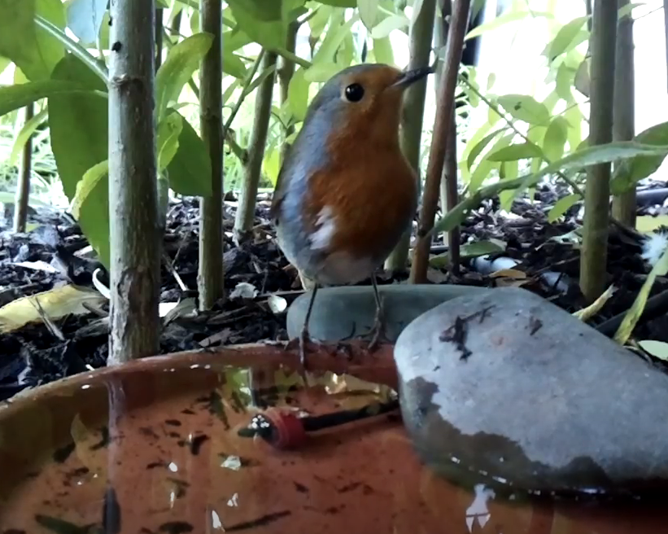
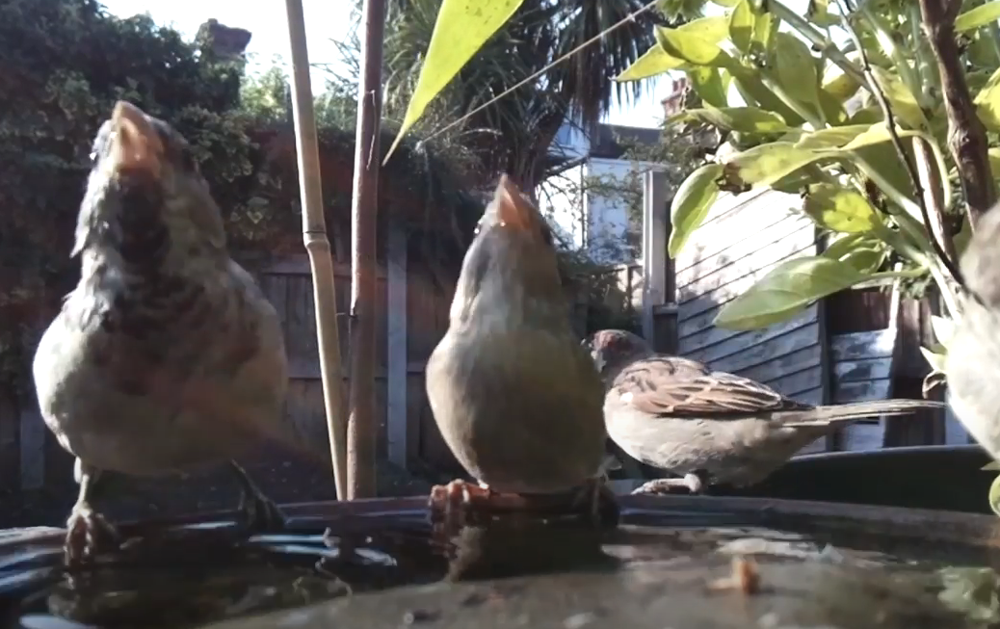
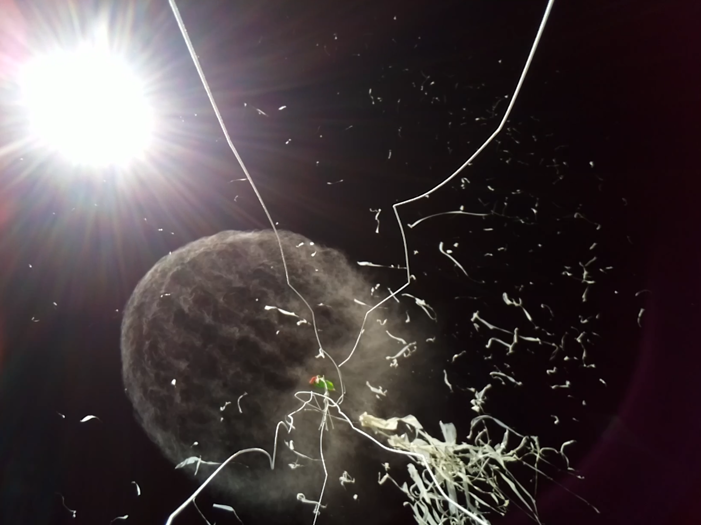

# PiCam simple

This is a simple python script to take a picture with the Raspberry Pi camera module every 7 seconds.

The number of seconds can be changed by editing the `time.sleep(x)` in the code.

The number of pictures taken can be changed by editing the `while` loop in the code.

The file can be set to automatically run on boot by adding the following line to the `/etc/rc.local` file:

`sudo python /home/pi/picam_simple.py &`

The `&` is important as it allows the script to run in the background.

The script can be stopped by running the following command:

`sudo killall python`

A Raspberry Pi with camera module:

Photos of birds in my garden taken with piCam:

Photos taken during a high altitude balloon flight:

